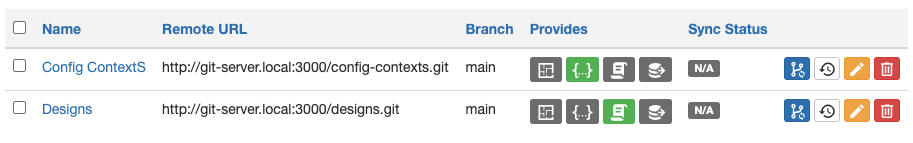
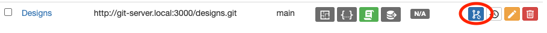
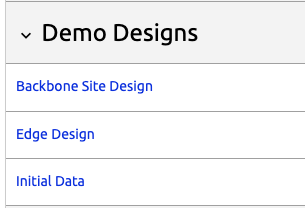
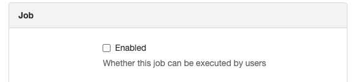
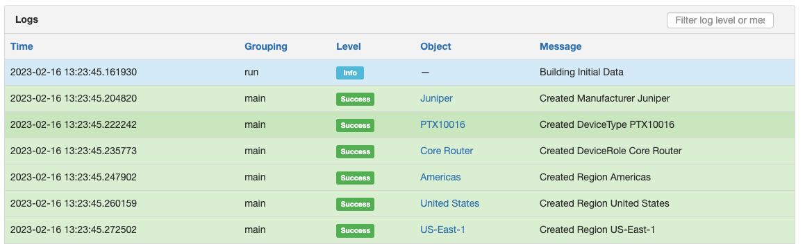

# Getting Started with the App

This document provides a step-by-step tutorial on how to get the App going and how to use it.

## Install the App

To install the App, please follow the instructions detailed in the [Installation Guide](../admin/install.md).

## First steps with the App

The easiest way to experience Design Builder is to run it in a local environment. To start a local environment, clone the design builder git repository and start the application stack. The only requirements for starting a local environment are `docker`, `docker-compose` and [invoke](https://www.pyinvoke.org/installing.html). Once the dependent tools have been installed, simply open a shell in the repository directory and run the command `invoke start`. This will start the entire application stack using docker compose. Once the application stack is up and running, navigate to <http://127.0.0.1:8080/> and login.

## What are the next steps?

The Design Builder application ships with some sample data and sample designs to demonstrate capabilities. Once the application stack is ready, run the command `invoke sample-data` to install enough data for demonstration purposes. Once the `invoke sample-data` command has completed, navigate to <http://127.0.0.1:8080/extras/git-repositories/>. You can get there by clicking the "Extensibility" navigation menu item, followed by the "Git Repositories" menu item.

You should see two git repositories installed:


Synchronize the "Designs" repository


Once the sync job has completed, you should have two designs listed under the "Jobs" -> "Jobs" menu item.


Note that both jobs are disabled. Nautobot automatically marks jobs as disabled when they are first synchronized from a git repository. In order to run these jobs, click the edit button  and check the "enabled" checkbox:



Once you click save the jobs should be runnable.

To implement any design, click the run button [run button](../images/screenshots/run-button.png). For example, run the "Initial Data" job, which will add a manufacturer, a device type, a device role, several regions and several sites. Additionally, each site will have two devices. Here is the design template for this design:

```jinja
--8<-- "development/git-repos/designs/designs/templates/initial_design.yaml.j2"
```

If you run the job you should see output in the job result that shows the various objects being created:



Once the initial data job has been run, try enabling and running the "Backbone Site Design" job to create a new site with racks and routers.

For more information on the composition of designs and design templates, check out the [design development](design_development.md) section. You can also check out the [Use Cases](app_use_cases.md) section for more examples.
