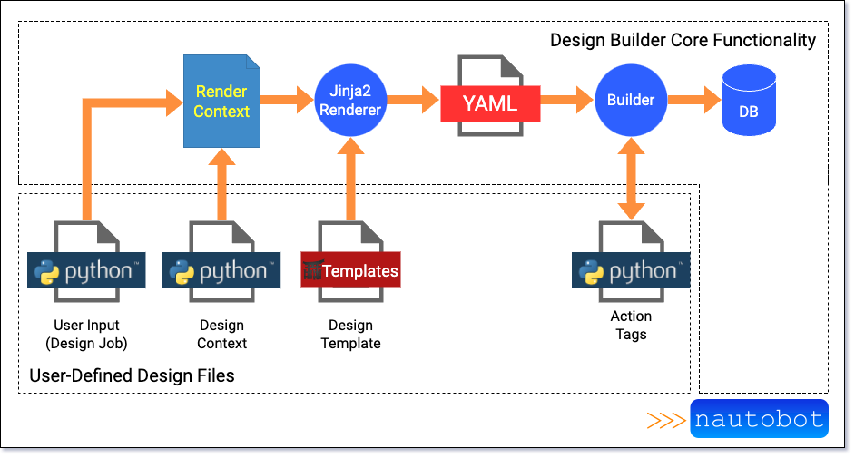

# Getting Started with Designs

If you've ever watched an episode of ["How it's made"](https://en.wikipedia.org/wiki/How_It%27s_Made), you probably already have a good idea how Design Builder works. Take the analogy of building a car assembly line in a plant, to support building many cars. There are various car parts made by a press, such as the hood, doors, bumper, etc. For a given car, you can only have a 40 inch hood but **not** the 50 inch hood that would go on the truck. The assembly line is created so that many of the things needed for the car are fixed, such as a specific kind of steering wheel, but the worker building the car can substitute variable components requested by the customer. This could include the car's color, sound system, and choice of sun roof. This ensures that the worker can only assemble the car with valid components and the outcome is guaranteed to be a proper car.

In the same way, the Design Builder app works to combine standardized design templates (the assembly line in this analogy) with a design context (the user supplied and computed information) to produce a design that can be used to create or update data within Nautobot, essentially creating the ability to expand the data massively from a few simple inputs. The combination of template, context and the job to build the objects are all collectively referred to as a design.

A special form of Nautobot Job, known as a Design Job, is the main entrypoint into a design's implementation. The design job is responsible for defining the inputs required from a user and any input validation that must take place prior to a job's implementation. Once a user has provided the necessary inputs, a design context is created from those inputs. The design context provides any variables and values needed in the design templates for rendering. The design context can provide computed values, perform database lookups within Nautobot, or perform provisioning tasks. Once the design context has been created, the design builder will render the design template using the design context as a Jinja render context.

The general flow of data through the design builder system can be visualized with the following picture:



For the remainder of this tutorial we will focus solely on the Design Job, Design Context and Design Template portions of that diagram.

## Design Components

Designs can be loaded either from local files or from a git repository. Either way, the structure of the actual designs and all the associated files is the same. All designs will be loaded from a top-level directory called `designs`. That directory must be defined as a Python package (meaning the directory must contain the file `__init__.py`) and all design classes must be either defined in this `designs` module or be imported to it. The following directory layout is from the sample designs provided in the [project repository](https://github.com/networktocode-llc/nautobot-plugin-design-builder/tree/develop/examples/backbone_designs):

``` bash
.
├── designs
│   ├── __init__.py
│   ├── core_site
│   │   ├── __init__.py
│   │   ├── context
│   │   │   ├── __init__.py
│   │   │   └── context.yaml
│   │   ├── jobs.py
│   │   └── designs
│   │       └── 0001_design.yaml.j2
│   ├── designs.py
│   └── initial_data
│       ├── __init__.py
│       ├── context
│       │   └── __init__.py
│       ├── jobs.py
│       └── designs
│           └── 0001_design.yaml.j2
└── jobs
    ├── __init__.py
    └── designs.py
```

The `designs` directory contains everything that is needed for implementing a design. In the above case, the directory contains two designs:

- Initial Design
- Core Site

Within the `designs` directory, the naming of modules and files is not important. However, it is recommended to use intuitive names to help understand each file's relationship with others. For instance, above there is are design contexts specified as both Python modules as well as YAML files and each design has exactly one design template. The relationship of context YAML files and context Python modules will be discussed later.

Since the entrypoint for designs is a specialized Nautobot job, we must configure our designs in such a way that the job can be imported into Nautobot. Nautobot jobs are always loaded from a `jobs` module, therefore Design Jobs must also be in the `jobs` module. However, Nautobot does not allow jobs to import Python modules that are not installed into the system. Since design jobs are not full Python packages, they are not installed into the underlying Nautobot Python environment. Therefore, the Design Builder app provides some helper functions to overcome this. To load any design that is defined in the `designs` top level module, simply load the designs in any module located within the `jobs` package. In this case, the `designs.py` is used to load the designs:

```python
"""Module for design jobs"""

from nautobot_design_builder.util import load_jobs

load_jobs()
```

This is a critical step, and without it Nautobot will not be able to find any designs that are located in the `designs` directory. The remainder of this tutorial will look at each of the three design components (Design Job, Design Context, and Design Template) in detail.

## DesignJob

Primary Purpose:

- Define the Job
- Provide the user inputs
- Define the Design Context and Design Templates

As previously stated, the entry point for all designs is the `DesignJob` class.  New designs should include this class in their ancestry. Design Jobs are an extension of Nautobot Jobs with several additional metadata attributes. Here is the initial data job from our sample design:

```python
--8<-- "examples/backbone_design/designs/initial_data/jobs.py"
```

This particular design job does not collect any input from the user, it will use `InitialDesignContext` for its render context and it will consume the `templates/initial_design.yaml.j2` file for its design. When this job is run, the Design Builder will create an instance of `InitialDesignContext`, read `templates/initial_design.yaml.j2` and then render the template with Jinja using the design context as a render context.

Here is another, more interesting design:

```python
--8<-- "examples/backbone_design/designs/core_site/jobs.py"
```

In this case, we have a design that will create a site, populate it with two racks, each rack will have a core router and each router will be populated with routing engines and switch fabric cards. The design job specifies that the user needs to supply a region for the new site, a site name and an IP prefix. These inputs will be combined in the design context to be used for building out a new site.

### Class Metadata Attributes

The design jobs above include standard metadata (`name` and `commit_default` for instance) attributes needed by Nautobot. Additionally, there are attributes specific to the design job. The `design_file`, `context_class` are required attributes specifying the design template and design context. A more detailed description of these attributes follows in the next section.

### `design_file`

Design file specifies the Jinja template that should be used to produce the input for the design builder. The builder will resolve the file's location relative to the location of the design job class.

### `design_files`

Design files specifies a list of Jinja template that should be used to produce the input for the design builder. The builder will resolve the files' locations relative to the location of the design job class. Exactly one of `design_file` or `design_files` must be present in the design's Metadata. If `design_files` is used for a list of design templates, each one is evaluated in order. The same context and builder are used for all files. Since a single builder instance is used, references can be created in one design file and then accessed in a later design file.

### `context_class`

The value of the `context_class` metadata attribute should be any Python class that inherits from the `nautobot_design_builder.Context` base class. Design builder will create an instance of this class and use it for the Jinja rendering environment in the first stage of implementation.

### `report`

This attribute is optional. A report is a Jinja template that is rendered once the design has been implemented. Like `design_file` the design builder will look for this template relative to the filename that defines the design job. This is helpful to generate a custom view of the data that was built during the design build.

## Design Context

Primary Purpose:

- Organize data from multiple places
- Validate data

As previously stated, the design context is a combination of user supplied input and computed values. The design context should include any details needed to produce a design that can be built. Fundamentally, the design context is a Python class that extends the `nautobot_design_builder.Context` class. However, this context can be supplemented with YAML. Once Design Builder has created and populated the design context it passes this context off to a Jinja rendering environment to be used for variable lookups.

That's a lot to digest, so let's break it down to the net effect of the design context.

A context is essentially a mapping (similar to a dictionary) where the context's instance properties can be retrieved using the index operator (`[]`). YAML files that are included in the context will have their values added to the context as instance attributes. When design builder is rendering the design template it will use the context to resolve any unknown variables. One feature of the design context is that values in YAML contexts can include Jinja templates. For instance, consider the core site context from the design above:

```python
--8<-- "examples/backbone_design/designs/core_site/context/__init__.py"
```

This context has instance variables `region`, `site_name` and `site_prefix`. These instance variables will be populated from the user input provided by the design job. Additionally note the class decorator `@context_file`. This decorator indicates that the `core_site_context.yaml` file should be used to also populate values of the design context. The context includes a method called `validate_new_site` to perform some pre-implementation validation (see the [next section](#context-validations) for details). The context also includes a method called `get_serial_number`. The implementation of this method is there only to demonstrate that some dynamic processing can occur to retrieve context values. For example, there may be an external CMDB that contains serial numbers for the devices. The `get_serial_number` method could connect to that system and lookup the serial number to populate the Nautobot object.

Now let's inspect the context YAML file:

```python
--8<-- "examples/backbone_design/designs/core_site/context/context.yaml"
```

This context YAML creates two variables that will be added to the design context: `core_1_loopback` and `core_2_loopback`. The values of both of these variables are computed using a jinja template. The template uses a jinja filter from the `netutils` project to compute the address using the user-supplied `site_prefix`. When the design context is created, the variables will be added to the context. The values (from the jinja template) are rendered when the variables are looked up during the design template rendering process.

### Context Validations

Sometimes design data needs to be validated before a design can be built. The Design Builder provides a means for a design context to determine if it is valid and can/should the implementation proceed. After a design job creates and populates a design context, the job will call any methods on the context where the method name begins with `validate_`. These methods should not accept any arguments other than `self` and should either return `None` when valid or should raise `nautobot_design_builder.DesignValidationError`. In the above Context example, the design context checks to see if a site with the same name already exists, and if so it raises an error. Any number of validation methods can exist in a design context. Each will be called in the order it is defined in the class.

## Design Templates

Primary Purpose:

- Generate YAML files that conform to Design Builder's design file format.

Design templates are Jinja templates that render to YAML. The YAML file represents a dictionary of objects that the design builder will create or update. The design builder supports all data models that exist within Nautobot, including any data models that are defined by applications installed within Nautobot. Top level keys in a design file map to the verbose plural name of the model. For instance, the `dcim.Device` model maps to the top level `devices` key within a design. Similarly, `dcim.Site` maps to `sites`.

Design templates support object hierarchy where relationship mapping takes place automatically during the design build process. For instance, consider the following:

```yaml
regions:
    - "name": "US-East-1"
    sites:
    - "name": "IAD5"
        status__name: "Active"
    - "name": "LGA1"
        status__name: "Active"
```

This design template will create a region with two sites. The Design Builder automatically takes care of the underlying relationships so that `IAD5` and `LGA1` are correctly associated with the `US-East-1` region. All relationships that are defined on the underlying database models are supported as nested objects within design templates.

### Special Syntax - Query Fields

Syntax: `field__<relatedfield>`

Double underscores between a `field` and a `relatedfield` cause design builder to attempt to query a related object using the `relatedfield` as a query parameter. This query must return only one object. The returned object is then assigned to the `field` of the object being created or updated. For instance:

```yaml
devices:
- name: "switch1"
    platform__name: "Arista EOS"
```

This template will attempt to find the `platform` with the name `Arista EOS` and then assign the object to the `platform` field on the `device`. The value for query fields can be a scalar or a dictionary. In the case above (`platform__name`) the scalar value `"Arista EOS"` expands the the equivalent ORM query: `Platform.objects.get(name="Arista EOS")` with the returned object being assigned to the `platform` attribute of the device.

If a query field's value is a dictionary, then more complex lookups can be performed. For instance:

```yaml
devices:
- name: "switch1"
    platform: 
        name: "Arista EOS"
        napalm_driver: "eos"
```

The above query expands to the following ORM code: `Platform.objects.get(name="Arista EOS", napalm_driver="eos")` with the returned value being assigned to the `platform` attribute of the device.

### Special Syntax - Action Tag

In addition to the object mapping described above, some additional syntax, in what are called `Action Tags` are available in YAML design templates. These actions tags have special meaning to the design builder. Sometimes additional information is needed before the Design Builder can determine how to update the database or how to map a relationship. These special cases are handled with action tags within the YAML design templates. Any mapping key that begins with an exclamation point (`!`) is considered an action tag and carries special meaning in the design template. An example of a situation where an action tag is required is when updating, rather than creating, an object in the database. If Nautobot already has an instance of a data model and a design only requires updating that model then the `update:` action tag can be used. This instructs the builder to update the object, rather than try to create it. The available action tags are documented below.

> Note: Any YAML key that begins with an exclamation point (`!`) must be quoted or a YAML syntax error will be raised. 

#### Action Tag - Update

Syntax: `!update:<field>`

This syntax is used when you know an object already exists and indicates to design builder that the object should be updated, rather than created. An example of this is updating the description on an interface.

```yaml
- "!update:name": "Ethernet1/1"
    description: "new description for Ethernet1/1"
```

This template will find the interface with the name `Ethernet1/1` and then set the `description` field.

#### Action Tag - Update or Create

Syntax: `!create_or_update:<field>`

Similar to `!update` this is used before a field name but will also create the object if it does not already exist. For example:

```yaml
devices:
    - "!create_or_update:name": bb-rtr-1
        "interfaces":
        - "!create_or_update:name": Ethernet1/1
            description: "Uplink to provider"
```

This template will cause design builder to attempt to first lookup the device by the name `bb-rtr-1`, if not found it will be created. Subsequently, the device interface named `Ethernet1/1` will also be either created or updated. Note that when being created all required fields must be specified. The above example would fail during creation since both the device and the interface are missing required fields. Design Builder performs model validation prior to saving any model to the database.

#### Action Tag - Git Context

Syntax: `!git_context`

Nautobot supports assigning config contexts from a git repository. Therefore the design builder supports generating config context data for an associated git repository. Using the `!git_context` key will indicate that design builder should store the rendered config context in a git repository. This functionality requires that a `destination` and `data` key are nested within the `!git_context` key, such as the below example:

```jinja
"!git_context":
    destination: "config_contexts/devices/{{ device_name }}.yml"
    data:
    
```

In this example, the included template will be rendered and a new file will be created named `config_context/devices/{{ device_name }}.yml`, and the content of the rendered data template will be written to the file. Note that the `context_repository` configuration key must be set in the `nautobot_config.py` in order for this feature to work. More information can be found in the [Git-Based Config Context documentation](git_config_context.md)

#### Action Tag - Reference

Syntax: `!ref`

When used as a YAML mapping key, `!ref` will store a reference to the current Nautobot object for use later in the design template. The value of the `!ref` key is used as the reference name within design builder. This feature is useful when you need to set a relationship field to the value of a previously created or updated object. One use-case where this can come up is when uplinks on a device are dynamically assigned based on the next available ports. The exact interfaces used may not be known but references to them can be created and then reused later to create cable terminations.

```jinja
# Creating a reference to spine interfaces.
#
# In the rendered YAML this ends up being something like 
# "spine_switch1:Ethernet1", "spine_switch1:Ethernet2", etc
#
#
- "!create_or_update:name": "{{ interface }}"
    "!ref": "{{ spine.name }}:{{ interface }}"
```

### Special YAML Values

In addition to the special syntax provided for mapping keys, there are also some action tags provided for values. The following document the available value tags within the Design Builder.

#### Action Tag Value - Reference

Syntax: `!ref`

When used as the value for a key `!ref:<reference_name>` will return the the previously stored object. In our example of cabling the reference lookup will look something like this:

```jinja
# Looking up a reference to previously created spine interfaces.
# 
# In the rendered YAML "!ref:{{ spine.name }}:{{ interface }}" will become something like
# "!ref:spine_switch1:Ethernet1", "!ref:spine_switch1:Ethernet2", etc
# ObjectCreator will be able to assign the cable termination A side to the previously created objects.
#
#

- termination_a: "!ref:{{ spine.name }}:{{ interface }}"
    termination_b: "!ref:{{ leaf }}:{{ leaf_to_spine[leaf_index][spine_index] }}"
    status__name: "Planned"

```

In this case, both `termination_a` and `termination_b` will be assigned the objects by looking for references by their name.

### Additional Jinja Control Syntax

The following section includes some additional information about Jinja syntax as well as describing some extensions to the Jinja parser that are provided by design builder.

#### The `` statement

`include` is a built-in jinja expression that provides the ability to separate sections of a template into individual files and then produce a completed template as a composition of those files. This is useful when you want to split up a large template or it makes logical sense to keep certain parts separate, or if some of the template might be shared between two parent templates.

Of particular note when using this Jinja expression is that the included files must have the same indentation as the point of inclusion, otherwise a YAML syntax error is introduced. The following example demonstrates the `include` expression:

```jinja
---
devices:

  - name: "{{ device_name }}"
    

```

The path to the included template is relative to the directory where the design class is defined for the particular design job. Using the example layout defined above, this path would be `designs/design_files/templates/switch_template.yaml.j2`.

#### The `block` statement

The `indent` expression is an extension that design builder provides to the Jinja parser. This expression will parse the wrapped content and prepend the same amount of space that precedes the `indent` tag itself. This is useful when including templates, allowing the included templates to be without indentation and to then be appropriately indented for the YAML document. For example if you included a template and needed to make sure there are 8 spaces before every line instead of padding every line in the included template with 8 spaces you could just put 8 spaces before the `{%+ indent $}` statement in the parent template and every line of the rendered included template will be padded with 8 spaces.

Note that the `+` in the left brace of `` is necessary for the `indent` expression to correctly preserve leading whitespace. This is only needed where indicated on the starting block. `` must be closed with ``

The following illustrates the `indent` usage:

```jinja
# parent.yaml.j2
---
devices:
    
```

```jinja
# child.yaml.j2
---
- name: "bb-rtr-1"
  status__name: "Active"
  site__name: "IAD1"
  device_role__name: "gateway"
  device_type__model: "DCS 7060PX4-32"
  platform__name: "Arista EOS"
  interfaces:
  - "!create_or_update:name": "Ethernet1/1"
    type: "400gbase-x-osfp"
```

When the design builder renders `parent.yaml.j2` it will result in the following content:

```jinja
devices:
    - name: "bb-rtr-1"
      status__name: "Active"
      site__name: "IAD1"
      device_role__name: "gateway"
      device_type__model: "DCS 7060PX4-32"
      platform__name: "Arista EOS"
      interfaces:
      - "!create_or_update:name": "Ethernet1/1"
        type: "400gbase-x-osfp"
```

As you can see, the device block for `bb-rtr-1` is correctly indented for the `devices` section.

### Extensions

Custom action tags can be created using template extensions. If a design needs custom functionality implemented as an action tag, the design developer can simply create a new tag (see the [extension](../dev/template_extensions.md) documentation). The new tag class can be added to the design using the extensions attribute in the design Meta class:

```python
class DesignJobWithExtensions(DesignJob):
    class Meta:
        name = "Design with Custom Extensions"
        design_file = "templates/simple_design.yaml.j2"
        extensions = [CustomExtension]
```

Several additional extensions ship with Design Builder and are located in the `nautobot_design_builder.contrib.ext` module. This module includes several useful extensions to help with things like connecting cables or creating BGP peers. However, these extensions may not be supported in all versions of Nautobot or in all configurations. For instance, the `bgp_peering` action tag requires that the BGP models plugin be installed. Given that these extensions may require optional packages, and are not supported across the entire Nautobot ecosystem they are distributed in the `contrib` package.

In order to use any of these contributed packages, simply import the `ext` module and include the necessary extensions in the design job:

```python
from nautobot_design_builder.contrib import ext

class DesignJobWithExtensions(DesignJob):
    class Meta:
        name = "Design with Custom Extensions"
        design_file = "templates/simple_design.yaml.j2"
        extensions = [ext.BGPPeeringExtension]
```
