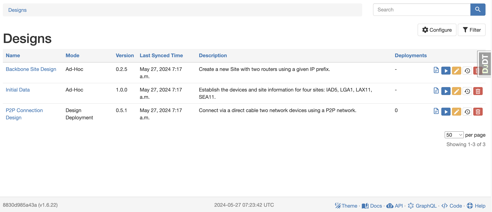
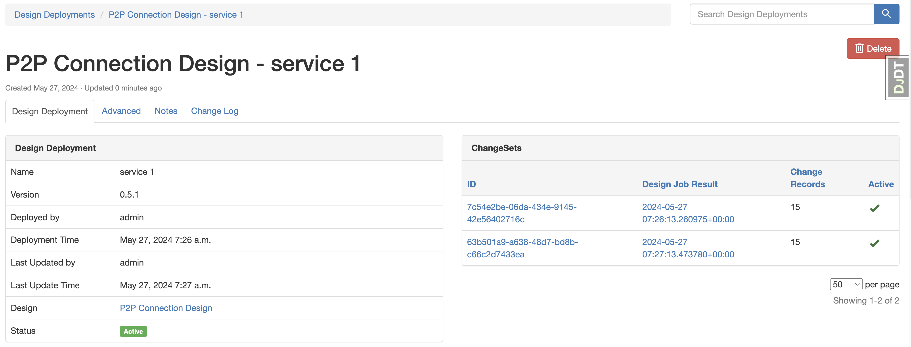
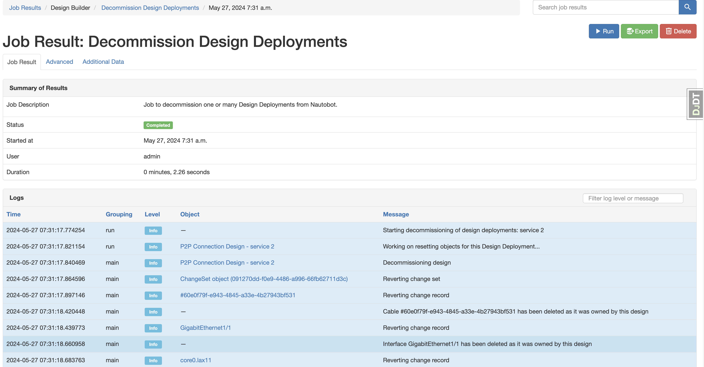

# Design LifeCycle

According to a design-driven approach, the Design Builder App provides not only the capacity to create and update data in Nautobot but also a complete lifecycle management of each deployment: update, versioning (in the future), and decommissioning.

The goal of a design-driven approach is to bring the following benefits to network automation solutions:

- Makes user interaction simpler and more reliable by minimizing input data and enforcing data validation at design level.
- Allows a full life cycle management of service/design implementation connecting all the data that is part of it.
- Offers a more effective understanding of network services from a design perspective, for users and other network automation components, such as a script changing the network that receives exactly the data it requires, or an operational validation integration that connects all the needed checks to validate a service state.

All the Design Builder UI navigation menus are under the Design Builder tab.

## `Design`

A `Design` is a one to one mapping with a Nautobot `Job`, enriched with some data from the Design Builder `DesignJob` definition. In concrete, it stores:

- The `Job` reference.
- The `mode` from the `DesignJob`.
- The `version` string from the `DesignJob`.
- The `description` string from the `DesignJob`.
- The `docs` string from the `DesignJob`.

In the next figure, the Designs table view exposes the previous information. Notice that for `ad-hoc` Designs, there are not deployments. When the Design is deployed, there is no traceability in Nautobot (this is the first mode supported by this app.)

From the `Design`, the user can manage the associated `Job` configuration (yellow edit icon), check the docs (doc icon), and trigger its execution (run blue icon).

## Design Deployment or `DesignDeployment`

Once a design (with the `DEPLOYMENT` mode) is deployed in Nautobot, a Design Deployment (or `DesignDeployment`) is created with the report of the changes implemented (i.e. `Journals`), and with actions to update or decommission it (see next subsections).

The `DesignDeployment` stores:

- The `name` of the deployment, within the context of the `Design`.
- The `Design` reference.
- The `version` from the `Design` when it was deployed or updated.
- When it was initially deployed and last updated, and the user who did it.
- The `status` of the design, for example `Active` or `Decommissioned`.
- The `Journals` that have been run in every create and update operation (more in the next section).

In the Design Deployment table view, you can see a few examples of deployments. Checking the deployment versus update time, you can notice that the "Initial Data - demo" deployment has been update after its initial deployment.

Each design deployment can be decommissioned (blue icon), updated (green icon), or deleted (red icon).

> Deletion is only possible if has been already decommissioned.

### Design Deployment Update

This feature provides a means to re-run a design deployment with different **input data**. Re-running the job will update the implemented design with the new changes: additions and removals.

It leverages a complete tracking of previous design implementations and a function to combine the new design and previous design, to understand the changes to be implemented and the objects to be decommissioned (more in next section).

The update feature comes with a few assumptions:

- All the design objects that have an identifier have to use identifier keys to identify the object to make them comparable across designs.
- Object identifiers should keep consistent in multiple design runs. For example, you can't target a device with the device name and update the name on the same design.
- When design provides a list of objects, the objects are assumed to be in the same order. For example, if the first design creates `[deviceA1, deviceB1]`, if expanded, it should be `[deviceA1, deviceB1, deviceA2, deviceB2]`, not `[deviceA1, deviceA2, deviceB1, deviceB2]`.

Every time you update a design deployment, a new `Journal` is created, tracking the changes for each iteration, as you can see in the next detail view for a deployment:

### Design Deployment Decommission

This feature allows to rollback all the changes implemented by a design deployment to the previous state. This rollback depends on the scope of the change:

- If the object was created by the design implementation, this object will be removed.
- If only attributes were changed, the affected attributes will be rolled back to the previous state. This works at inner attribute level. For example, if a config context (i.e., a dict) had a key with an original value that was changed by a design deployment, the decommission will rollback the value to the previous state while keeping the other key/values untouched.

The decommissioning feature takes into account potential dependencies between design implementations. For example, if a new p2p design depends on devices that were created by another design, the design deployment can't be decommissioned until the p2p dependencies are also decommissioned to warrant consistency.

Once a design deployment is decommissioned, it's still visible in the API/UI to check the history of changes but without any active relationship with Nautobot objects (in a "Decommissioned" status). Once decommissioned, the design deployment can be deleted completely from Nautobot.

The decommissioning job outputs a log with all the detailed operation reverting to previous state (i.e., deleting or recovering original data):

