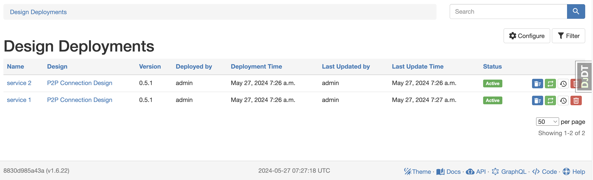

# Design LifeCycle

According to a design-driven approach, the Design Builder App provides not only the capacity to create and update data in Nautobot but also a complete lifecycle management of each deployment: update, versioning (in the future), and decommissioning.

The goal of a design-driven approach is to bring the following benefits to network automation solutions:

- Makes user interaction simpler and more reliable by minimizing input data and enforcing data validation at design level.
- Allows a full life cycle management of service/design implementation connecting all the data that is part of it.
- Offers a more effective understanding of network services from a design perspective, for users and other network automation components, such as a script changing the network that receives exactly the data it requires, or an operational validation integration that connects all the needed checks to validate a service state.

All the Design Builder UI navigation menus are under the Design Builder tab.

## `Design`

A `Design` is a one to one mapping with a Nautobot `Job`, enriched with some data from the Design Builder `DesignJob` definition. In concrete, it stores:

- The `Job` reference.
- The `mode` from the `DesignJob`.
- The `version` string from the `DesignJob`.
- The `description` string from the `DesignJob`.
- The `docs` string from the `DesignJob`.

In the next figure, the Designs table view exposes the previous information. Notice that for `ad-hoc` Designs, there are no deployments. When ad-hoc Designs are executed, there is no traceability in Nautobot (this is the original behavior of this app).


From the `Design`, the user can manage the associated `Job` configuration (yellow edit icon), check the docs (doc icon), and trigger its execution (run blue icon).

In order to select the new **mode** (by default, the classic/ad hoc is selected), you have to set it in the `Meta` class of the `DesignJob`:

```py
from nautobot_design_builder.choices import DesignModeChoices

class ExampleDesign(DesignJob):
    ...
    class Meta:
        design_mode = DesignModeChoices.DEPLOYMENT
```

## Design Deployment or `DesignDeployment`

Once a design (with the `DEPLOYMENT` mode) is deployed in Nautobot, a Design Deployment is created with the report of the changes implemented (i.e. `ChangeSets`), and with actions to update or decommission it (see next subsections).

The `DesignDeployment` stores:

- The `name` of the deployment, within the context of the `Design`.
- The `Design` reference.
- The `version` from the `Design` when it was deployed or updated.
- When it was initially deployed and last updated, and the user who did it.
- The `status` of the design, for example `Active` or `Decommissioned`.
- The `ChangeSets` that have been run in every create and update operation (more in the next section).

In the Design Deployment table view, you can see a few examples of deployments. Checking the deployment versus update time, you can notice that the "Initial Data - demo" deployment has been update after its initial deployment.



Each design deployment can be decommissioned (blue icon), updated (green icon), or deleted (red icon).

> Deletion is only possible if has been already decommissioned.

### Design Deployment Update

This feature provides a means to re-run a design deployment with different **input data**. Re-running the job will update the implemented design with the new changes: additions, changes and decommissions (more in the next section). It relies on the previous `ChangeSet` to understand the necessary changes.

The update feature comes with a few assumptions:

- All the design objects that have an identifier have to use identifier keys to identify the object to make them comparable across designs.
- Object identifiers should keep consistent in multiple design runs. For example, you can't target a device with the device name and update the name on the same design.
- When design provides a list of objects, the objects are assumed to be in the same order. For example, if the first design creates `[deviceA1, deviceB1]`, if expanded, it should be `[deviceA1, deviceB1, deviceA2, deviceB2]`, not `[deviceA1, deviceA2, deviceB1, deviceB2]`.

Every time you update a design deployment, a new `ChangeSet` is created, tracking the changes for each iteration, as you can see in the next detail view for a deployment:


### Design Deployment Decommission

This feature allows to rollback all the changes implemented by a design deployment to the previous state. This rollback depends on the scope of the change:

- If the object was created by the design implementation, this object will be removed.
- If only attributes were changed, the affected attributes will be rolled back to the previous state. This works at inner attribute level. For example, if a config context (i.e., a dict) had a key with an original value that was changed by a design deployment, the decommission will rollback the value to the previous state while keeping the other key/values untouched.

The decommissioning feature takes into account potential dependencies between design implementations. For example, if a new p2p design depends on devices that were created by another design, the design deployment can't be decommissioned until the p2p dependencies are also decommissioned to warrant consistency.

Once a design deployment is decommissioned, it's still visible in the API/UI to check the history of changes but without any active relationship with Nautobot objects (in a "Decommissioned" status). Once decommissioned, the design deployment can be deleted completely from Nautobot.

There is a decommissioning mode to only remove the link between the design objects and the design deployment without actually reverting the state of the objects. Decommissioning, with the `delete` checkbox _not_ set, is only removing the references but keeping the data.

The decommissioning job outputs a log with all the detailed operation reverting to previous state (i.e., deleting or recovering original data):


### Design Deployment Import

Design Builder addresses

- greenfield use cases by creating new data from a design
- brownfield use cases by importing existing data related to a new design deployment

In the "deployment" mode, a design deployment tracks all the objects and attributes that are "owned" by it. With the import functionality, orphan objects and attributes will be incorporated into a new design deployment as if they have been set by it.

The import logic works like this:

1. If the object that we reference doesn't exist, normal design creation logic applies
2. If an object that we want to "create" already exists, normal design creation logic _also_ applies
3. If an object that we want to "create_or_update" already exists
    - If it's not owned by another design deployment, we get "full_control" of it and of all the attributes that we define (including the identifiers)
    - If it already has an owner, we don't claim ownership of the object, but we still may claim the attributes, except the identifiers
4. If an object that we want to "update" already exists
    - There is no claim for "full_control" ownership
    - There is a claim for the attributes, except the identifiers
5. In all cases, the attributes that a design is trying to update are claimed. These attributes can't be claimed by any other design. If so, the import fails pointing to the conflict dependency.
6. The imported changes (attributes) show the same old and new value because we can't infer which was the previous value (in most cases, it would be `null` but we can't be sure)
